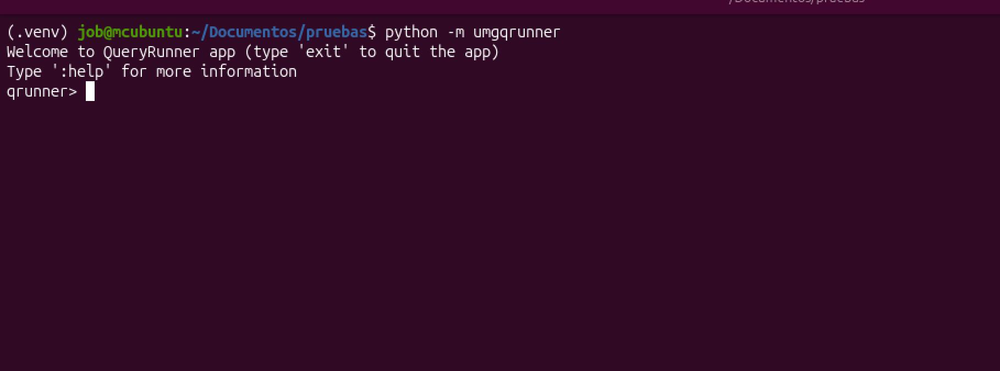
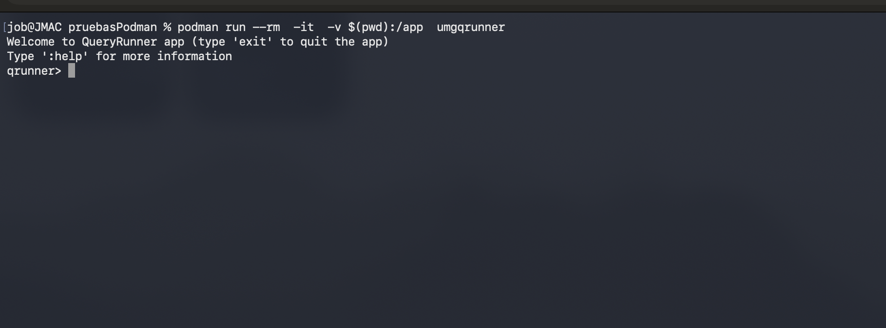

# QueryRunner — motor de consultas sobre archivos CSV/JSON desde consola

CLI tool para ejecución de consultas tipo SQL sobre archivos CSV o JSON

### Pasos de Instalación

- Directamente sobre su entorno Python:
  - Tener instalado python en su computadora.
  - Instalar la herramienta pip para poder realizar la instalación del paquete desde el index de PyPi
  - Una vez preparado su ambiente ejecutar el siguiente comando:
      ```bash
      pip install umgqrunner
      ```
    Ejecución de herramienta usando CLI interactivo:
  
      ```bash
        python -m umgqrunner
      ```
    
    
  
- Instalación usando docker o podman:
  - Si tiene instalado en su computadora la herramienta para conetendores "Docker" o "Podman", puede descarga la imagen preconfigurada con todo lo necesario sin tener python instalado en su máquina loca.
    - Para Hacerlo siga los sigueintes pasos:  Descargue la imagen desde Docker hub con el siguiente comando
        ```bash
         docker pull jjgonzalezg/umgqrunner
        ```
    - Construya un contendor usando el siguiente comando:
      ```bash
         podman run --rm  -it  -v $(pwd):/app  umgqrunner
      ```
      
      Puede intercambiar el comando docker por podman según la herramienta que use, el comando funciona igual independientemente que herramienta utiliza.
    - La estructura del comando es la siguiente:
      - podman / docker -  es el enginer con el que ejecutará aplicaciones dentro de un contenedor
      - run - crea un contenedor basado en una imagen 
      -  "--rm"  - Le indica a docker /podman que ejecute el contenedor y mientras el aplicativo se esté ejecutando lo mantenga vivo, al terminar su ejecución que mate el contenedor, esto evita que se queden recurso tomados de su computadora una vez Ud deja de usar la herramienta.
      -  "-it" - Le indica a docker / podman que debe quedarse ecuchando las interaciones del teclado, esto es necesario para mantener la CLI interactiva de la herramienta
      -  "-v"  - Le indicamos que montaremos un volumen dentro del contenedor (en este caso mapeando un directorio local de nuestra computadora dentro del directorio /app del contenedor)
      -  "$(pwd):/app" - Se le indica al contenedor que monte dentro de su directorio /app, el directorio actual de nuestra computadora como un volumen, esto hace que el contenedor conozca y tenga acceso a todos los archivos que tengamos dentro de ese directorio
      -  "umgqrunner"  - Nombre de la imagen con la cual queremos crear el contenedor
      
     

- [Ejemplos de comandos interactivos](docs/ejemplos.md)
- [Guia de Optimización de plan de ejecución](docs/optimization.md)